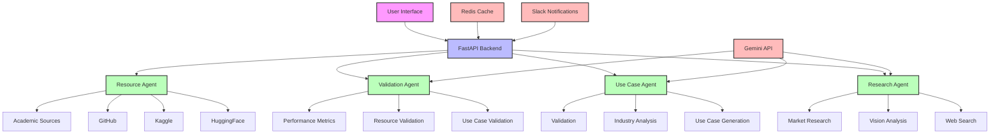

```mermaid
graph TD
    A[User Interface] --> B[FastAPI Backend]
    B --> C[Research Agent]
    B --> D[Use Case Agent]
    B --> E[Resource Agent]
    B --> F[Validation Agent]
    
    C --> G[Web Search]
    C --> H[Vision Analysis]
    C --> I[Market Research]
    
    D --> J[Use Case Generation]
    D --> K[Industry Analysis]
    D --> L[Validation]
    
    E --> M[HuggingFace]
    E --> N[Kaggle]
    E --> O[GitHub]
    E --> P[Academic Sources]
    
    F --> Q[Use Case Validation]
    F --> R[Resource Validation]
    F --> S[Performance Metrics]
    
    T[Redis Cache] --> B
    U[Slack Notifications] --> B
    V[Gemini API] --> C
    V --> D
    V --> F
    
    style A fill:#f9f,stroke:#333,stroke-width:2px
    style B fill:#bbf,stroke:#333,stroke-width:2px
    style C fill:#bfb,stroke:#333,stroke-width:2px
    style D fill:#bfb,stroke:#333,stroke-width:2px
    style E fill:#bfb,stroke:#333,stroke-width:2px
    style F fill:#bfb,stroke:#333,stroke-width:2px
    style T fill:#fbb,stroke:#333,stroke-width:2px
    style U fill:#fbb,stroke:#333,stroke-width:2px
    style V fill:#fbb,stroke:#333,stroke-width:2px
``` 